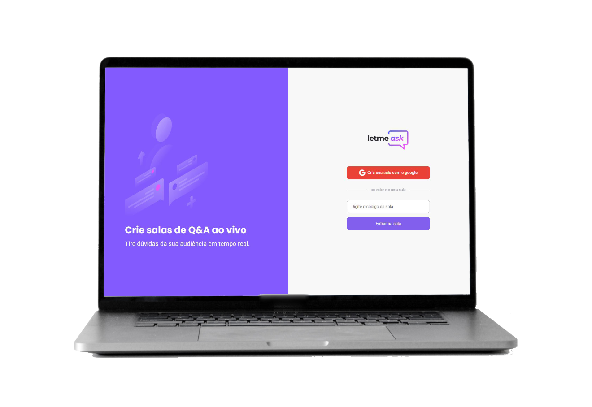

<h1 align="center">
    
</h1>

  <a href="#-tecnologias">Tecnologias</a>&nbsp;&nbsp;&nbsp;|&nbsp;&nbsp;&nbsp;
  <a href="#-projeto">Projeto</a>&nbsp;&nbsp;&nbsp;|&nbsp;&nbsp;&nbsp;
  <a href="#-layout">Layout</a>&nbsp;&nbsp;&nbsp;|&nbsp;&nbsp;&nbsp;

 

  

## Tecnologias

Esse projeto foi desenvolvido com as seguintes tecnologias:

- [React](https://reactjs.org)
- [TypeScript](https://www.typescriptlang.org/)
- [Firebase](https://firebase.google.com)

## Projeto

O Letmeask é uma aplicação que visa conectar pessoas que estão assistindo alguma transmissão ao vivo com a finalidade de fazer perguntas à quem está transmitindo. Os usuários podem interagir entre si curtindo a pergunta de outros usuários que julgar relevante e o administrador consegue saber quais foram as perguntas mais curtidas, proporcionando uma experiência única e objetiva.

## Layout

Nos links abaixo você encontra o layout do projeto web e também do mobile. Lembrando que você precisa ter uma conta no [Figma](http://figma.com/) para acessá-lo.

- [Layout Web](https://www.figma.com/file/tIdbGkmHmtigwZesEFHbWs/Letmeask-(Copy)?node-id=0%3A1)

---

Feito com ♥ by Felipe Matheus baseado no projeto criado pela Rocketseat através do evento NextLevelWeek Together.

